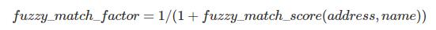

# collect_addresses_from_web

## Key point to trade off

The main criterion that determines our technical choices is the requirement for generalization.

There are nearly 200 Red Cross National Societies in the world. 
Therefore, there will be 200 initial web sites with different structures, technologies and terms, which is what we called heterogeneity. 
On the other hand, multiple languages are used on their web pages and there is no uniformed language (like English) version of each site.

According to those points, we choose most general, simple, non-country-specific approaches.

## Phases
* Collecting web pages 
* Identify target pages
* Extracting addresses
* Semantic matching

### Collecting web pages

Folder:`pilot_scraping`

We use Scrapy as framework for data collection. 
The most benefit of utilization of framework is the robustness to errors/exceptions.

The addresses/locations are scattered in whole web sites and in most case they don't indicate the location of local branch, for instance, the locations in news which are where activities happen.
Therefore, we need to find the page that contains real local branch information.

When we checked the pages of some initial societies that contain local branch information manually, and we found the heterogeneity is shown on the dimensions below:
* They are different in where target page placed in site(set homepages as entry)
    * Uzbekistan: Home page -> sitemap -> rational/local branches || redcrescent.uz/indexe.html -> redcrescent.uz/map.html -> redcrescent.uz/regione.html
    * Netherlands: Home page -> hulp-in-nederland || www.rodekruis.nl -> www.rodekruis.nl/hulp-in-nederland/
    * Lebanese: Home page -> (About us) structure || www.redcross.org.lb/index.aspx?pageid=907 -> www.redcross.org.lb/SubPage.aspx?pageid=175&PID=154
    * Guatemala: Home page -> Contáctanos || www.cruzroja.gt -> www.cruzroja.gt/contactanos/
    * Malawi: Home page -> Where we work || www.redcross.mw -> www.redcross.mw/where-we-work-2/
* They are different in the technology of displaying information
    * Uzbekistan: Map formed by Flash
    * Netherlands: Map formed by JavaScript framework
    * Guatemala: Text
* They are different in languages they use
    * Uzbekistan: EN,RU,TG
    * Netherlands: Dutch
    * Lebanese: EN,AR
    * Guatemala: ES
    * Malawi: EN
    
To get the pages contain local branch information, there are two approaches:
* write down the paths to those pages by manual check
* collect all the pages and filter the target page by rules or model

Considering we have near 200 initial sites and there probably will be more in the future, the first approach is not general enough.
Therefore, we used the second approach. Besides, to get the web page sources generated by scripts, we used webdriver to load whole pages and save all sources.

The scrapy project is saved in the root of this repo, run cmd: 
`scrapy crawl pilot_scraping` to start the crawler.
Note: Chrome webdriver and python library selenium should be installed in advance.
The web sources of each page are saved in folder `pilot_scarping/corpus`. Each web page is assigned an unique id, and the URLs and the mapping are saved in `pilot_scarping/corpus/mapping`

Some important parameter settings:
* Max depth:3 
* DEPTH_PRIORITY = 1 (BFS)
* Enable DOWNLOADER_MIDDLEWARES (because we embedded web driver into middle ware)

### Identify target pages

Folder:`phases/identify_target_pages`

*Warning: be careful about path; files moved before*  

The way we identify target pages is to calculate the "density" of location/address. 
We tried many ways:
* Named entity recognition: "The Netherlands is a good place" => [("the Netherlands","LOC")] =>1
* Tokenization+(Part of Speech tagging for filtering)+dictionary based matching(fuzzy match or elasticsearch score): "The Netherlands is a good place" => [("Netherlands","Noun"),("place","Noun")] => [{"name":"Netherlands","score":17},{"name":"the Netherlands","score":15}]
* Counting how many location contained in the page by traversing dictionary: "The Netherlands is a good place" => 1

In the end, we chose the last one. On the one hand, both first two methods are language specified, on the other hand there will be too much complexity introduced to the systems. The name of places are provided by GEONet Names Server (GNS), the data can be accessed on [Google drive ](https://drive.google.com/open?id=1clS9nLTiJxgurex9wcPSsOwzGJTgSxVq)

By implementing the code in `fuzzy_match.ipynb`, we selected the pages with highest density for each initial site.

('NL', 'https://www.rodekruis.nl/hulp-in-nederland/')

('MI', 'https://www.redcross.mw/project/wash-program-profile/')

('GT', 'https://www.cruzroja.gt/contactanos/')

('LE', 'http://www.redcross.org.lb/SubPage.aspx?pageid=209&PID=162')

By this method, we succeed in NL and GT, and failed in MI and LE. 

For MI, there is no local branch information on their website:

For LE, they only list name of local branches. But it still shows, our solution is not perfect as we were not able to located the target page since there are many names of address are mentioned in that page.

### Extracting addresses

Folder:`phases/extract_addresses`

*Warning: be careful about path; files moved before*  

After detecting target pages, we picked the HTML files of target pages for NL and GT, saved in `pilot_scraping/NL&GT/` as file `NL_html` and `GT_html`.
 
In notebook `pilot_scraping/NL&GT/location_extraction.ipynb`, we first defined function `walker`. 
Through it we can traverse all nodes and extract information by node. 
To reduce false positive samples, we set up rules to validate possible true positive addresses.

Considering a typical address: `Vincent van Goghstraat 4 Zevenaar, Gelderland 6901 DK`, we can use rules below:
* By regular expression: 
    * keep the sentences contain at least one character and one comma => `r"^(?=.*[A-Za-z])(?=.*,).*$"`
    * keep the sentences contain at least one character, one comma and one number => `r"^(?=.*[A-Za-z])(?=.*\d)(?=.*,).*$"`
* By attribute:
    * remove sentences length exceeding 100

Apparently, the regular expressions can only be applied to Latin languages. 
On the one hand, for other languages, the range of Unicode number need to be determined case by case.
On the other hand, comma probably will not be used in some languages in addresses for example: 北京市东城区北新桥三条8号

For which regular expression rule we should choose, we first tested two rules on Guatemala case as there are only 21 addresses on that page.
If we take number into count, we will get about 22 candidates and by manual check, it covers 19 out of 21 addresses we hope to identify. The problem comes from some addresses without number in it like `Aldea San Antonio, Serchil, San Marcos`.
If we relax the restriction, we will get 26 candidates for GT case and it covers 202 out of 205 addresses for NL case.
Therefore we choose the regular expression that only consider comma, because for the next phase we will put them all to Google map query, it can be corrected or filtered by Google map service.
And then we applied it to Netherlands case.
Comparing to the archived information stored on the website `https://www.rodekruis.nl/wp-content/plugins/superstorefinder-wp/ssf-wp-xml.php`, our method succeeded to get all addresses.

### Semantic matching

Folder:`phases/semantic_match`

*Warning: be careful about path; files moved before*  

Now we have all possible addresses, but it only shows that there is a local branch, but we don't know which one it is.

Since our goal is to merge these addresses with the ones from other sources (social media, Google Maps) we need to link the addresses to those.
In the following, we will talk about social media addresses, but the same approach can be applied to other sources, as long as there's a name associated to each address. 

The idea is that beside of the addresses, we also look for names of local branches from the same page and match them to assign a meaning to each address (in fact, what we did is to assign an address to each possible name of local branch, as "bad names" will be ignored when we merge them to social media).

Therefore, we kept all sentences/phrase, and automatically check whether there are location/place name in it from the [GeoNames database](https://www.geonames.org/) (more accurate and complete than NGA data set and support fuzzy query). We filtered out all the sentences not containing name of location (including candidate addresses).

Our first version matching is only based on the distance: calculate the distances of all pairs of name of location and addresses, and for each name, matched with the closest address.
To evaluate this method, we hand checked the accuracy of the matching on Guatemala case.
We matched 15 out of 21 names correctly. 

By analyzing the result, there is one possible issue which would harm to the accuracy.
In some cases, the geolocation of one address is closer to other administrative area instead of its administrative area.
Because the geolocation of administrative area is in the center of the area, while the local branch could be located near the boundary of this area where is more close to the neighbor area.

To reduce the problem and make the solution applicable to other cases, we introduced a weight to make the names and addresses in the same administrative area "closer". 
This weight is associated to the similarity on semantics of names and addresses. The more similar they are, the more the distance is scaled down.

Before we calculate the weight, we need to extract the unique part of the name as we only compare them based on the string. For example, in Guatemala case, the local branches are named as `Delegación XXX`, and in Netherlands case the names are like `Afdeling XXX` which are useless.
Therefore, we used TF-IDF model to extract main "topic" of each name to reduce the effect of common phrases.

The weight is consisted of two parts: 
* Fuzzy match factor: how similar two strings are
* Duplication factor: how many times name of local branch is mentioned on address

where fuzzy_match_score is range from 1 to 100.

After scaling down the distance by semantics, in the case of Guatemala the accuracy increased to 18/21, and we found 2 of failed cases are "bad" names whose semantics meaning is context dependent (Sede Central and Delegación Guatemala).

Now, our dataset from web scraping is complete with geolocation which is collected when we measured the distances, even though there are some false positive samples (not a name of local branch) and mismatches.

-----------------

## How to use the pipeline

When you want to apply this whole system to other initial sites, you need to follow the instruction of pipeline.

The whole pipeline is consist of two components:
* Scraping module
* Data processing

### Scraping

To apply scraping module to other countries, you can edit file `pilot_info.csv`, by adding country codes(compatible to NGA country code) and URL of the home pages.

Then type command line `scrapy crawl pilot_scraping` to start the scrapy engine. The data will be stored in fold `corpus`.

PS. I do recommend to slice the the list of contries into multi groups and used multiple threads to run parallelly when you have lot of countries to query.

The detail can be refered to section [*Collecting web pages*](#collecting-web-pages)

### Data processing

Before start, be sure the data from National Geospatial-intelligence Agency (NGA) is placed in somewhere, you can download it from [Google drive ](https://drive.google.com/open?id=1clS9nLTiJxgurex9wcPSsOwzGJTgSxVq)

To make it more flexible, we implemented all the required functionality into functions in notebook `local-branch\pilot_scarping\NL&GT\Pipeline.ipynb`

The whole pipeline is split to four main functions(in order to make customization):
* `identify`: identify the target page of each initial society
    * Parameters:
        * query_file: the path of file `pilot_info.csv`
        * corpus_dir: the path where all collected page sources stored
        * location_dir:: the path where NGA location folder placed
    * Return value(s):
        * A dataframe with field: country code; page id of target page; URL or target page
* `extact_address_name`: extract addresses from (one) target page
    * Parameters:
        * file: the path of source file of target page
        * api_key: the API key of Google service platform
        * country_code: A two alphabetic character code from the [Geopolitical Entities and Codes (formerly FIPS 10-4 standard)](http://geonames.nga.mil/gns/html/countrycodes.html)
    * Return value(s):
        * addresses_list: a list of addresses; each elements is a dictionary containing information of address
        * name_list: a list of (possible) names of local branch; each elements is a dictionary containing information of "name"
* `semantic_matching`: match the addresses to names by the semantic distance （time consuming)
    * Parameters:
        * addresses_list: a list of addresses; generated by previous stage
        * name_list: a list of (possible) names of local branch; generated by previous stage
    * Return value(s):
        * A dataframe with field: address; semantic distance; candidate name; latitude of address; longitude of address; weight(indicate the similarity of address and name)

