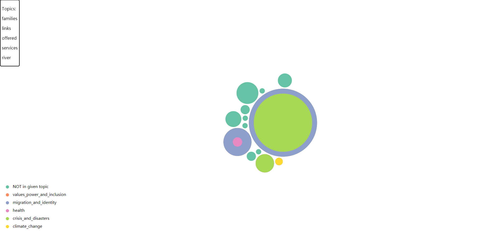

# extract topics from social media
## Context

This project is meant to provide an approach to measure how many posts are about given topics in countries.

In most of cases, we can simplely  calculate the term frequency of each topics in posts. But there are few problems:
* the meaning of goals is abundant, for instance, the topic "crisis" could be related to contents such as "war","flood" and so on. We need to enrich the meaning of goals and make it computable.
* the post quantity in each countries is imbalanced, for example, in Netherlands there are 200 local branches and over 100 social media accounts posted more than 20K of posts while there are only 260s FB post in Malawi. We should set up a fair measuring function. 
* the things that local branches are talking but not in given topics are important as well.

Therefore, our approach is to expand meaning of given topics, extract topics from social media posts and match them.

## Phases

* meaning enrichment of given topics
* topic extraction from social media posts
* scoring and matching
* visualization（pending)

### Meaning enrichment of given topics

The idea of enrichment is to find key words related to the topics which can describe the topics in some extend.

First we collected multiple information for each topic in different aspects, it includes 'description', 'strategy' and "extra".
TODO:ADD INFORMATION ABOUT THE DESCRIPTION ABOVE

Second, we performed TF-IDF to extract key words with top 5 high score in each dimension. Thus, those key  words can be used to describe the topic. Besides, the score and type of information can provide a vector for computing with other documents based on vector of words.

###  Topic extraction from social media posts

Here, the idea of topic extraction is to utilize topic model to cluster documents(social media posts) into different groups and use some key words to represent the group. 

#### The idea of current unsupervised topic models 

##### Unigram model

In UM, bag-of-word model is used(it means the order of words is not considered), it assumes that documents are independent to each other and words in documents are independent to each other as well. Assume we have V words, then UM think there is a "god" generate documents by following rules:
* the "god" has only one dice with V faces for each word and each face has different probability.
* to generate a document with n words, the "god" role n times of dice

Therefore, when we have a existed corpus, we can calculate the probability of each words.

However,  Bayesians argue that the dice itself can be a random variable. So, the Dirichlet distribution is used to estimate the dice.

##### PLSA model

The previous model doesn't take topic into account, it assumes that the posts from a financial journalist will be mainly about financial topics and few about something else. 
Therefore, PLSA assume a document is generated as below:
* there are two kinds of dices, one is doc-topic with K faces for each topic; another is topic-word with V faces for each word.
* now, there are K topic-word dices with number range from 1 to K
* for each document, it goes with following steps
    * role a doc-topic dice, get number Z of topic
    * role the No. Z topic-word dice, generate a word
    
Now, as long as we have a corpus, we can compute the probability of topics for each document.
However, this model assumes that the probabilities for each face of two kinds of dice are fixed.

##### LDA model

LDA is the Bayesian version of PLSA. Therefore, LDA assumes that both two kinds of dices are generated from a distribution which can be computed and estimated by given posterior.

The basic idea of LDA is the same as PLSA, practically, the training state is to calculate the parameters of the distribution of two kinds of "dices".

However, even though LDA has good performance in general, there are still some problems need to concern:
* LDA is more suitable to long texts rather than short texts theoretically, while our data consist of social media posts ranging from tens of words to over 500 words
* The number of topics should be given manfully and another parameter is the prior of each word which we are not able to go such far

The experiment of LDA on our datasets will be discussed later in another section.

##### GSDMM model

To deal with the problems related to short texts, there is one model called Gibbs Sampling Dirichlet Mixture Model[(GSDMM)](https://www.semanticscholar.org/paper/A-dirichlet-multinomial-mixture-model-based-for-Yin-Wang/058ad0815ce350f0e7538e00868c762be78fe5ef) invented in 2014 by scientists from Tsinghua University (Top 1 in CN in my mind :) ).

This model follow the idea of LDA, but it goes with another way. The original paper starts with an analogy:

Imagine there is a class, teacher asks students to form groups by themselves according to their interest in movies. Let everyone write down what movies they are interested in . 
Apparently It can not be done at once, therefore, the clustering is performed by students moving to new groups iteratively according to the following rules:
* students will (preferably) choose groups with more people
* students will (preferably) choose groups have most similar interest in movies

However, this "choose" is not fixed, it only shows that students has more chance to choose/the probability for choosing those groups are higher.

For each iteration, each student scores each group (including empty group), and role a dice to decide which group to go where the probability of each group is according to the scores.

After long iterations, the clustering will converge (in some extend). Here, for our case, each social media post can be viewed as a student and each non-stop word can be viewed as a name of movie.

The benefit of GSDMM is shown as below:
* It can handle short text nicely.
* The number of groups can be determined automatically as long as setting a upper bound
* the parameter tuning is simple and easy to understand
* The scores for documents to each group are not effected by size of document (for LDA longer documents can get higher score) as the score here is the probability to its group which is normalized
 
In the end, we choose GSDMM as our final model.

#### Experiments
We experimented both LDA and GSDMM on Malawi(low quantity,English) and Netherlands(large quantity,Dutch).
For each datasets, we first removed urls. And then tokenize, stemming and lemmatize.

For evaluation, we consider both the average scores over documents and manually evaluation by checking whether the doc with highest score in one can be summarized by the key words(topic) of the group.
##### LDA
In notebook `notebooks/LDA for single.ipynb`, we tested LDA model on Malawi Facebook posts which consist of about 260 posts and Netherlands Facebook posts with over 20000 posts.

The LDA model is provided by gensim. The accepted form of inputs is [(id_word,frequency)]. After training, the documents will be placed in different groups.

For each group, there will ba a vector of words indicate the "score" of this word in the group, we pick the top 10 words to represent the group. And in the same time choose one document to directly show the result.

To evaluate the result by numbers and for parameter tuning, we used topic coherence to measure the performance as score.
The detail of topic coherence is not what we need concern too much, the implementation and related academic paper is included in the [page](https://radimrehurek.com/gensim/models/coherencemodel.html)

For parameter tuning, we set different number of total groups, decay rate, and iteration numbers. Besides, for each parameter setting, we run with 5 times with different random state to ensure the stability of the model.

The results show that:
* The most import parameter is the number of groups, the more it is the higher the score is (it's similar to normal clustering cases)
* The score of each document is highly effected by its size; this leads the TOP1 documents too long; by dividing scoring by doc size, the short text can be put ahead, but it is hard to find the connection between text and key words
* The scores among one parameter setting with 5 different random states are close, which shows that the model is stable

##### GSDMM

In notebook `notebooks/LDA for single.ipynb`, we tested GSDMM model on Malawi Facebook posts.

And in notebook `notebooks/topic matching.ipynb`, the meaning enrichment and topic extraction by GSDMM are merged.

In notebook `notebooks/Dutch gsdmm.ipynb`, the GSDMM model is applied to Netherlands case; it is separate because stemming and lemmation for Dutch language should be specified

Note that there is no standard implementation powered by a mature framework for GSDMM like LDA. The implementation we are using is from [an individual github repo](https://github.com/rwalk/gsdmm)

Plus: we tried to rewrite the implementation by numpy matrix operation as its inner logic is written by pure python. However, the result shows that our "fast implementation" is not faster than the original one nor able to get the same result(unable to get the same convergence level); this implementation is test in notebook `notebooks/ experimental codes/efficient gsdmm.ipynb`

For GSDMM model, there are three main parameters that we need concern: alpha, beta and number of topic

Qualitatively, alpha and beta are the parameters related to the two rules mentioned above respectively.

Alpha (for rule one): the higher the alpha is the higher chance that students(doc) will choose the groups with less students(doc); in extreme case with alpha=0, doc will never choose groups without any member 

Beta (for rule two) : the lower the beta is the higher chance that students(doc) will choose the groups share same similar interest (here is the number of overlapped words)

Beside of alpha and beta, the K is also important as it determines the upper bound of the number of groups.
Even though the GSDMM will automatically determine how many groups remain (after convergence, some groups will be empty), we still need to set this number.

The quantity of documents effects the number of groups significantly, for example in malawi case it will converge with around 15-17 groups under 260 docs while in Netherlands case there is no empty group with same parameter setting

For evaluation, the scores for each doc to each group are (normalized) probabilities.

Therefore, there is one thing need to concern that: because of the imbalance of sizes among cases, whether we should keep same parameter setting for different cases(for example we can increase beta to produce empty group in Netherlands case)

By manually checking, we found that the top docs (with highest probability to choose this group) are very tightly related to its key words (many key words show on the doc multiple times). This shows the performance of GSDMM is higher than that of LDA. And another good result is that the long text won't have advantage on short text because of GSDMM's scoring function.

Beside of this good properties, GDSMM also has shortcoming. The model is very computation consuming, for Netherlands case with 20000+ posts, it will take few hours with 40 iteration. Therefore, if this model is needed in the future, it would be better to be rewritten by more efficient way or using other languages(for example the implementation we are using also has rust version).

#### Conclusion

In this social media topic extraction case, due to the limit of text length, GSDMM has better performance compared to LDA. Even though we are not able to evaluate them at same standard, the top docs in each group under GSDMM model are well summarized by the key words. Therefore, we recommend to use GSDMM for topic extraction of social media posts.

### Scoring and Matching

In notebook `notebooks/topic matching.ipynb`, we matched given topics and extracted topics from social media.

First, we invert all stems back to the most use words in our documents (see our implementation of `produce_mapping`).

Then, considering that the words in given topics are not completely the same, we used fuzzwuzzy to scoring the similarity between words. If the fuzzywuzzy score between a word from given topic and a word from extracted topic is higher than 90 (90% of similarity), we assume they match to each other.Note that, this matching should not be directly applied to Non-English languages. For Netherlands case, those extracted words should be translated to English first, then matched to given topics.

For each pair of given topic and extracted topic, the sum of the occurrence of word in extracted topic multiply TF-IDF score of matched word in given topic are considered as the score of these two topics.

Here is one simple result of scoring and matching. The index indicates the id of each extracted topics. And the following five columns are the score of it in each given topics. NoDoc means the number of document in this group and last five column are the key words in this group.

|    index |   climate change |   crisis and disasters |   health |   migration and identity |   values, power and inclusion |   NoDoc | key_word 5   | key_word 4     | key_word 3   | key_word 2   | key_word 1   |
| --------:|-----------------:|-----------------------:|---------:|-------------------------:|------------------------------:|--------:|:-------------|:---------------|:-------------|:-------------|:-------------|
|        0 |              0   |                  270   |      0   |                     45.3 |                             0 |     165 | communities  | support        | disaster     | society      | said         |
|        1 |              0   |                    0   |      0   |                      0   |                             0 |       1 | undp         | materogy       | dept         | dodma        | organised    |
|        2 |              0   |                    0   |      0   |                      0   |                             0 |       1 | mobilization | phone          | thankstoicrc | power        | learn        |
|        3 |              0   |                    0   |      0   |                      0   |                             0 |       9 | conducted    | households     | children     | cancer       | campaign     |
|        4 |              2.4 |                    0   |      0   |                      0   |                             0 |       2 | value        | discrimination | crescent     | movement     | human        |
|        5 |              0   |                    0   |      0   |                      0   |                             0 |       7 | looking      | ntcheu         | support      | cooking      | teacher      |
|        6 |              0   |                    0   |      0   |                      0   |                             0 |       3 | dropout      | machinga       | district     | liwonde      | youth        |
|        7 |              0   |                    0   |      0   |                      0   |                             0 |       1 | distribution | launch         | president    | blankets     | society      |
|        8 |              0   |                    0   |      0   |                      0   |                             0 |       1 | victims      | ndifeamodzi    | society      | floods       | donation     |
|        9 |              0   |                    0   |      0.5 |                      1   |                             0 |      28 | families     | links          | offered      | services     | river        |
|       10 |              0   |                    2.4 |      0   |                      0   |                             0 |      12 | water        | people         | houses       | rains        | floods       |
|       11 |              0   |                    0   |      0   |                      0   |                             0 |       3 | redcross     | centers        | public       | workshop     | society      |
|       12 |              0   |                    0   |      0   |                      0   |                             0 |      17 | passa        | participatory  | graphic      | training     | facilitators |

Note that this result is the based on model given parameters: alpha=0.5，beta=0.1. If we set alpha=0.01 and beta=0.01, there will be more groups of topic and the imbalance between groups in quantity will be much more larger (which will cause more groups with only one doc there). Therefore, we do recommend to adjust the parameter setting to a proper one.

### Visualization
Since we have assigned scores on each given topics to each extracted groups, We can make more quantitative analysis based on it. But the numbers in table are only numbers, to make it more clear and easy to hands on the overview situation, we implemented a dynamic and interactive visualization.

The goals to visualization is as following:
* To visualize the quantity of post in each extracted groups
* To visualize the distribution of given topics among extracted topics
* The mixture of given topics in one extracted topic should be displayed

There are also other requirements:
* The solution should be scalable and general
* The solution should be light weight

Therefore, we decide to use HTML with D3 framework for visualization. One example on Malawi case is shown below:

We use concentric circles to represent each extracted topics, the area is proportional to the number of post in this topic. And each color represents a given topic(and one color to indicate no given topic mentioned in this group). The probation of each color in the circles is based on their scores. The higher score compare to others' the given topic has, the larger area its color will occupy.

When mouse is hovering over the circles, there will be a box show at left top and display the key words of this group. It will change when mouse is hovering over different circles and disappear when mouse is not on any circle. 

The visualization is dynamic and interactive, because you can drag the circles and they will act based on force simulation. This solves the problem about circle placement and scalability.

Thn data processing has been implemented in HTML file by JS code. As long as you put 2030_goals.csv to data folder with same fields like the table we show on previous section, the visualization will be finished by open the `visualization.html` file on browser.
