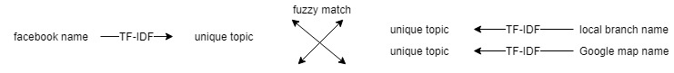
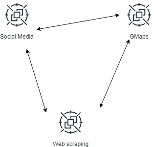
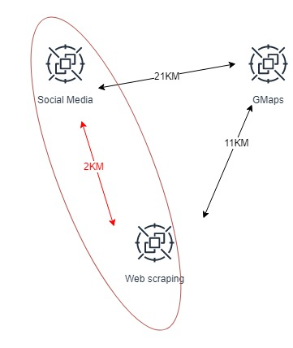

### Geolocation correction 

-------------------------

#### new version
Folder:`phases/geolocation_correction`

*Warning: be careful about path; files moved before*  

What we have now:
* Name of social media, addresses and geolocation  from social media,  metadata, feeds
* Name of red cross on google map, addresses and geolocation from google map search, contact info
* Name of local branch from web sites,  addresses(geolocation get from google map) 

The idea is to merge them according to the semantic meaning of names from different sources(social media, web scraping, google maps)

Then we will get a table with each line have fields: fb_id, geolcation provided by social media, geolocation from web and google map.

Now since we have geolocation from three sources and none of them are not able to completely thrust, we need to make a decision which one we should choose as the geolocation of the social media.

We used voting to decide which geolocation we should thrust, the voting is consist of two steps:
* First, find the closest two as majority
* Second, pick one within the closest pair with thrust chain: GMaps>Social media> Web scraping

When we calculated the distance, we also take the similarity of address in to consideration and reduce the distance by the similarity of addresses in the pairs.

In the end, for each local branch social media(Facebook and Twitte), we assign a most reliable geolocation and address to it. 

------------------------
#### old version
In this phase, it will be divided into few steps:
* Get the Geo location of each candidate address
* Evaluate the performance and compare to alternative approach(GMaps approach) 
* Correct addresses on social media by two data sources

In notebook `pilot_scraping/NL&GT/Integration_GM_SM_WC.ipynb`, we used Google API to get the Geo location of each address and saved them into `pilot_scarping\NL&GT\nl_result_full_name.csv` and `pilot_scarping/NL&GT/gt_result_full_name.csv` with columns address name, latitude, longitude and name returned by Google map API.

And then we exported all Geo location of local branches provided by their map interface and saved them to file `correct_nl.csv` for evaluation. In evaluation stage we will call this data set as TRUE data set.

Now we have all three Geo datasets: GMap, Web scraping and social media(for NL case we have TRUE dataset). We made simple visualization of two countries.
The files are `pilot_scarping\NL&GT\GT_visualization.html` and `pilot_scarping\NL&GT\NL_visualization.html`.

Before the evaluation, there are few things need to talk about.

First, the data points that are very close to each other should be merged into one. 
This happens in GMap dataset and TRUE dataset as sometimes two or more local branch offices are in same building share same address but have slightly different geo location. 
This can not be solved by removing duplication, therefore we implemented merging algorithm merged data points with distance under 50 meters and replace them by Geometric mean of two data points.
Iterate until number of data points in the dataset doesn't change.

Second thing is the metrics of evaluation.
Here, we have TRUE dataset where correct Geo locations labled(with no guarantee, but it is the most reliable data set can be viewed as concrete truth) and possible Geo location from other sources (GMap and web scraping) we call FOUND.
In perfect situation, all `Ture` and all `Found` match each other one to one without multiple match.
And there will be a threshold to define "match ", considering it's not possible to get exactly match in numbers. And we choose 100 meters as threshold.
Therefore, in our case, we will evaluate the performance of two approaches by counting the probation of one to one match out in TRUE and FOUND datasets, which is similar to precision and recall.

The evaluation goes as this:

After merging all close points, we computed the distances between every pair (`True`,`Found`) and made a table.
Then, we calculated the number of one to one match by two axis for how many TRUE points found and how many FOUND points are true.

Below shows a example of how this we calculate the metrics.

|   | A | B | C |
|---|---|---|---|
| 1 | 1 | 0 | 1 |
| 2 | 0 | 1 | 0 |
| 3 | 1 | 0 | 0 |
| 4 | 0 | 0 | 0 |

Here, 1 means the distance between two points is under the threshold. Horizontally, there are 2 (B,C) out of 3 are one to one match; vertically, there are 2 (2, 3) out of 4 are one to one match.
In our case, the probation of one to one match in FOUND is the precision; and in TRUE is recall.

The result shows that for GMap approach, the precision is 48.7% and the recall is 63.2%; for web scraping approach, the precision is 95.9% and the recall is 91.7%. 
This shows that web scraping approach has better performance in general and we have 90% confidence to say we can extract correct addresses from web scraping.
However, this evaluation is based on the assumption that the information of TRUE data set is correct and complete(actually not, there are some errors and missing points, but in general they're correct).

The last step is to assign a Geo location to each social media to correct the addresses written on their pages. Considering GMap data set is still useful, the way we assign a Geo location is to choose the closest point in both two data set. 

-----------------

## How to use the pipeline

When you want to apply this whole system to other initial sites, you need to follow the instruction of pipeline.

The whole pipeline is consist of two components:
* Scraping module
* Data processing

### Scraping

To apply scraping module to other countries, you can edit file `pilot_info.csv`, by adding country codes(compatible to NGA country code) and URL of the home pages.

Then type command line `scrapy crawl pilot_scraping` to start the scrapy engine. The data will be stored in fold `corpus`.

PS. I do recommend to slice the the list of contries into multi groups and used multiple threads to run parallelly when you have lot of countries to query.

The detail can be refered to section [*Collecting web pages*](#collecting-web-pages)

### Data processing

Folder:`pipeline`

***Strong Warning**: be careful about path; files moved before*  

Before start, be sure the data from National Geospatial-intelligence Agency (NGA) is placed in somewhere, you can download it from [Google drive ](https://drive.google.com/open?id=1clS9nLTiJxgurex9wcPSsOwzGJTgSxVq)

To make it more flexible, we implemented all the required functionality into functions in notebook `local-branch\pilot_scarping\NL&GT\Pipeline.ipynb`

The whole pipeline is split to four main functions(in order to make customization):
* `identify`: identify the target page of each initial society
    * Parameters:
        * query_file: the path of file `pilot_info.csv`
        * corpus_dir: the path where all collected page sources stored
        * location_dir:: the path where NGA location folder placed
    * Return value(s):
        * A dataframe with field: country code; page id of target page; URL or target page
* `extact_address_name`: extract addresses from (one) target page
    * Parameters:
        * file: the path of source file of target page
        * api_key: the API key of Google service platform
        * country_code: A two alphabetic character code from the [Geopolitical Entities and Codes (formerly FIPS 10-4 standard)](http://geonames.nga.mil/gns/html/countrycodes.html)
    * Return value(s):
        * addresses_list: a list of addresses; each elements is a dictionary containing information of address
        * name_list: a list of (possible) names of local branch; each elements is a dictionary containing information of "name"
* `semantic_matching`: match the addresses to names by the semantic distance （time consuming)
    * Parameters:
        * addresses_list: a list of addresses; generated by previous stage
        * name_list: a list of (possible) names of local branch; generated by previous stage
    * Return value(s):
        * A dataframe with field: address; semantic distance; candidate name; latitude of address; longitude of address; weight(indicate the similarity of address and name)
* `correction`: use web and Gmap data to correct the geolocation of social media
    * Parameters:
        * social_media: dataframe read from file like "social_media_Netherlands.csv"
        * social_media_extend: dataframe read from file like "page_info_Netherlands.csv"
        * web: dataframe generated from semantic matching
        * gmap: read from file like "GMaps_Netherlands.csv"
    * Return value(s):
        * A dataframe with field: facebook id; name; username; final address; final latitude; final longitude; Twitter id
    * N.B.
        * User need to read dataframe ahead as the format and field of dataframe is not fixed

Easy way to use: change the variables on sources block to what you want
